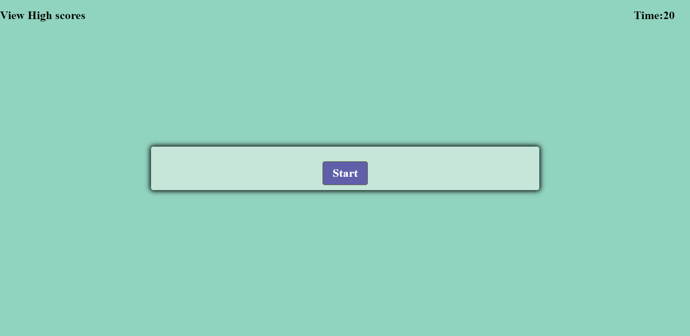

# Code-Quiz# 

# Description
 
  These is a code Quiz project which includes  the basic information required to complete the weekely challange.
  And below is the list of items I used upon the completion of the password generator.

  

  Here is a link to deploy my application:
   * Repo: https://github.com/senait77/Code-Quiz

   * Deploy: https://senait77.github.io/Code-Quiz/

## Table of contents

* [Installation](#installation)
* [Usage](#usage)
* [Credits](#credits)
* [License](#license)
* [Technologies](#technologies)
* [Project status](#project-status)
* [Contact](#contact)

## Installation
To run these project on the development enviroment:
* open " Git bash"
* "pwd" (print working directory simply tells you in which directory you are)
* use "code ."  to open it in your text editor, in these case VS code.
* *  Go to your GitHub.com 
* creat a new repository, where you can push your work remotly
* clone it with your local computer
* set your branch to main
* use " git add . " to add your work
* use " git commit -m "" " to commit chages you have made and finnally
* use "git push origin main" to push it to your remote repository
* * Now my project is locally saved in my computer and remotely saved on my GitHub.

## Usage 
Screen shot 
* 

## Credits
My web page is based and inspired by;
 * https://www.w3schools.com/
 * The course module
 * Some youtube videos
 * Our friend Google.

 ## License
* [https://choosealicense.com/licenses/agpl-3.0/](https://choosealicense.com/licenses/agpl-3.0/)

## Technologies
On the top of the  HTML and CSS, these passwprd generator uses the Javascript :

* varables
* data Structure such as arrays and objects
* DOM ( DOcument Object Model)
* loop (for loop and forEach loop)
* Functions
* Event listner
* varable comparison

## Project status
These project is still in developing mood, as it will be updated to a more upgraded code quiz APP .

## Contact
 * Created by Senait T Gerezgiher 
 * Email: senutekie77@gmail.com - Feel free to reach me and I am ready to assist.
